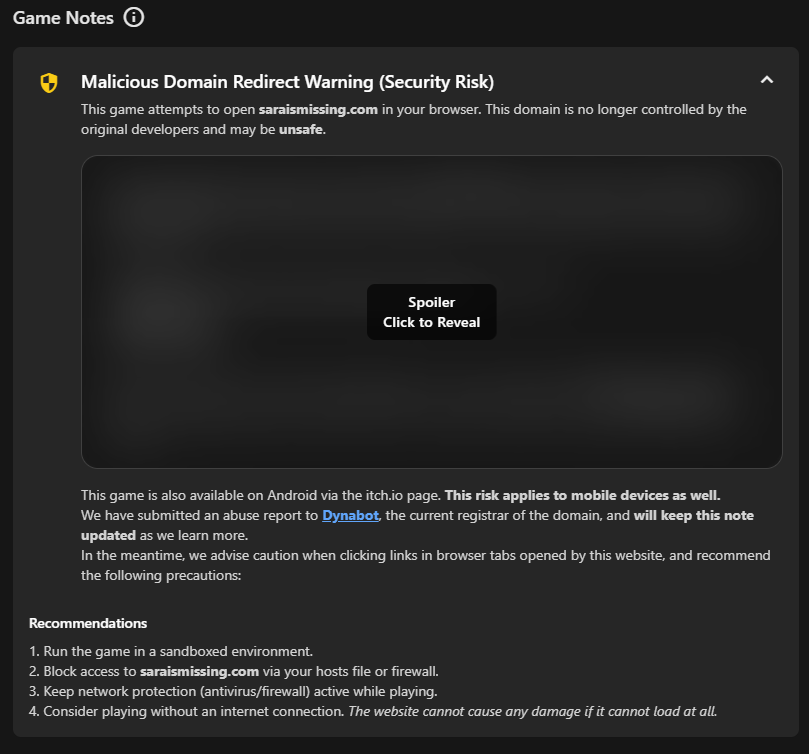

# DeadForge External Assets **××**

This repository contains:
- curated game assets for the DeadForge project, including icons, heroes, logos, headers and capsule images for software from various other platforms
- notes about specific games, including security warnings, compatibility issues, content warnings, and more

## External Assets

### Assets List
<spoiler>

You can find the full asset list here (updated on every push to DeadForgeAssets and periodically every 6 hours)

 

<!-- This list is not made to be edited manually, and is handled by @deadcodebot --->
<!------------ That's why we have these cool comments in the README :3 ------------->
<!------------------------------- ASSETS_LIST_START -------------------------------->

| File name / Game name Game Source Game ID | iconUrl | logoUrl | heroUrl | headerUrl | capsuleUrl |
|:---------:|:------:|:------:|:------:|:--------:|:----------:|
| A Quiet Place Itch 3543464 | ❌ | ❌ | ❌ | ❌ | ❌ |
| [ETS2DS+ATSDS.jsonc](https://github.com/DeadCodeGames/DeadForgeExternalData/blob/main/DeadForgeAssets/curated/games/ETS2DS%2BATSDS.jsonc) Steam 2239530 |  | ✅ | ✅ | ✅ | ✅ |
| Arctic Combat Steam 212370 |  | ❌ | ❌ |  | ❌ |
| Battle for Graxia Steam 90530 |  | ❌ | ❌ |  | ❌ |
| Bits & Bops Demo Steam 2200650 |  | ❌ | ❌ |  |  |
| Bloodwash Itch 1199082 | ❌ | ❌ | ❌ | ❌ | ❌ |
| [BTD6.jsonc](https://github.com/DeadCodeGames/DeadForgeExternalData/blob/main/DeadForgeAssets/curated/games/BTD6.jsonc) Epic 7786b355a13b47a6b3915335117cd0b2 | ✅ | ✅ | ✅ | ✅ | ✅ |
| Brawl Busters Steam 109410 |  | ❌ | ❌ |  | ❌ |
| [Buckshot Roulette.jsonc](https://github.com/DeadCodeGames/DeadForgeExternalData/blob/main/DeadForgeAssets/curated/games/Buckshot%20Roulette.jsonc) Steam 2835570 |  | 🇯🇵 ✅ |  |  |  |
| Codename Gordon Steam 92 |  | ❌ | ❌ |  | ❌ |
| Cold Call [Christmas Horror] Itch 840022 | ❌ | ❌ | ❌ | ❌ | ❌ |
| [Crosshair V2.jsonc](https://github.com/DeadCodeGames/DeadForgeExternalData/blob/main/DeadForgeAssets/curated/games/Crosshair%20V2.jsonc) Epic 8d3fd7a1c6034e799f04a2c8cce520a3 | ✅ | ✅ | ✅ | ✅ | ✅ |
| DELTARUNE (Chapter 1 & 2 DEMO) Steam 1690940 |  | ❌ | ❌ |  | ❌ |
| dire decks Itch 1924109 | ❌ | ❌ | ❌ | ❌ | ❌ |
| District 187 Steam 221080 |  | ❌ | ❌ |  | ❌ |
| [DDLC+.jsonc](https://github.com/DeadCodeGames/DeadForgeExternalData/blob/main/DeadForgeAssets/curated/games/DDLC%2B.jsonc) Epic c5109bdceb3a453bb38c2fdc964ddee8 | ✅ | ✅ | ✅ | ✅ | ✅ |
| DON'T FEED IT Itch 3471790 | ❌ | ❌ | ❌ | ❌ | ❌ |
| Don't Look Away From The Colors Itch 432501 | ❌ | ❌ | ❌ | ❌ | ❌ |
| [Epic Games Store.jsonc](https://github.com/DeadCodeGames/DeadForgeExternalData/blob/main/DeadForgeAssets/curated/games/Epic%20Games%20Store.jsonc) Epic -1 | ✅ | ✅ | ✅ | ✅ | ✅ |
| [ETS2DS+ATSDS.jsonc](https://github.com/DeadCodeGames/DeadForgeExternalData/blob/main/DeadForgeAssets/curated/games/ETS2DS%2BATSDS.jsonc) Steam 1948160 |  | ✅ | ✅ | ✅ | ✅ |
| Evalua†ion Itch 3281349 | ❌ | ❌ | ❌ | ❌ | ❌ |
| Fall Guys Epic 0a2d9f6403244d12969e11da6713137b | ❌ | ❌ | ❌ | ❌ | ❌ |
| Fears to Fathom - Carson House Itch 1869318 | ❌ | ❌ | ❌ | ❌ | ❌ |
| Fears to Fathom - Home Alone Itch 1111002 | ❌ | ❌ | ❌ | ❌ | ❌ |
| Fears to Fathom - Ironbark Lookout Itch 2321764 | ❌ | ❌ | ❌ | ❌ | ❌ |
| Fears to Fathom - Norwood Hitchhike Itch 1339579 | ❌ | ❌ | ❌ | ❌ | ❌ |
| Fears to Fathom - Woodbury Getaway Itch 2966876 | ❌ | ❌ | ❌ | ❌ | ❌ |
| Fishing Planet Epic ab68facc57fa457a9832de2a982048e9 | ❌ | ❌ | ❌ | ❌ | ❌ |
| FOOTAGE 1985 Itch 1534262 | ❌ | ❌ | ❌ | ❌ | ❌ |
| [Fortnite.jsonc](https://github.com/DeadCodeGames/DeadForgeExternalData/blob/main/DeadForgeAssets/curated/games/Fortnite.jsonc) Epic Fortnite | ✅ | ✅ | ✅ | ✅ | ✅ |
| [FNF.jsonc](https://github.com/DeadCodeGames/DeadForgeExternalData/blob/main/DeadForgeAssets/curated/games/FNF.jsonc) Itch 792778 | ✅ | ✅ | ✅ | ✅ | ✅ |
| Friday Night Funkin' Multiplayer Itch 894206 | ❌ | ❌ | ❌ | ❌ | ❌ |
| Genshin Impact Epic 41869934302e4b8cafac2d3c0e7c293d | ❌ | ❌ | ❌ | ❌ | ❌ |
| [Godot Engine.jsonc](https://github.com/DeadCodeGames/DeadForgeExternalData/blob/main/DeadForgeAssets/curated/games/Godot%20Engine.jsonc) Itch 188955 | ✅ | ✅ | ✅ | ✅ | ✅ |
| [GTA5.jsonc](https://github.com/DeadCodeGames/DeadForgeExternalData/blob/main/DeadForgeAssets/curated/games/GTA5.jsonc) Epic 9d2d0eb64d5c44529cece33fe2a46482 | ✅ | ✅ | ✅ | ✅ | ✅ |
| Haunted Memories Steam 241640 |  | ❌ | ❌ |  | ❌ |
| [Hell is Others.jsonc](https://github.com/DeadCodeGames/DeadForgeExternalData/blob/main/DeadForgeAssets/curated/games/Hell%20is%20Others.jsonc) Epic 0e70be0cea0446599acb4c26d2e925f9 | ✅ | ✅ | ✅ | ✅ | ✅ |
| Honkai Impact 3rd Epic 0dc22b543a40440fab5a98d1e40c02c1 | ❌ | ❌ | ❌ | ❌ | ❌ |
| Honkai: Star Rail Epic 86ae9acccf8443e18fca6950e0181288 | ❌ | ❌ | ❌ | ❌ | ❌ |
| [itch.io.jsonc](https://github.com/DeadCodeGames/DeadForgeExternalData/blob/main/DeadForgeAssets/curated/games/itch.io.jsonc) Itch -1 | ✅ | ✅ | ✅ | ✅ | ✅ |
| Limbo Epic Hazelnut | ❌ | ❌ | ❌ | ❌ | ❌ |
| Malware Demo Steam 3021010 |  | ❌ | ❌ |  | ❌ |
| [Marvel Rivals.jsonc](https://github.com/DeadCodeGames/DeadForgeExternalData/blob/main/DeadForgeAssets/curated/games/Marvel%20Rivals.jsonc) Epic 575efd0b5dd54429b035ffc8fe2d36d0 | ✅ | 🇬🇧 ✅ 🇨🇳 ✅ | ✅ | 🇬🇧 ✅ 🇨🇳 ✅ | 🇬🇧 ✅ 🇨🇳 ✅ |
| [Mini Metro.jsonc](https://github.com/DeadCodeGames/DeadForgeExternalData/blob/main/DeadForgeAssets/curated/games/Mini%20Metro.jsonc) Steam 287980 |  |  |  | 🇨🇿 ✅ |  |
| [Neon Abyss.jsonc](https://github.com/DeadCodeGames/DeadForgeExternalData/blob/main/DeadForgeAssets/curated/games/Neon%20Abyss.jsonc) Epic a26f991a5e6c4e9c9572fc200cbea47f | ✅ | 🇬🇧 ✅ 🇨🇳 ✅ | ✅ | 🇬🇧 ✅ 🇨🇳 ✅ | 🇬🇧 ✅ 🇨🇳 ✅ |
| ocean of eyes Itch 3228009 | ❌ | ❌ | ❌ | ❌ | ❌ |
| Pandora Saga: Weapons of Balance Steam 106010 | ❌ | ❌ | ❌ |  | ❌ |
| RAWMEN: Food Fighter Arena 🍜 Epic 93228a1a7b2b4205811d8edf930a0c18 | ❌ | ❌ | ❌ | ❌ | ❌ |
| Renaissance Heroes Steam 221790 |  | ❌ | ❌ |  | ❌ |
| Rocket League® Epic Sugar | ❌ | ❌ | ❌ | ❌ | ❌ |
| [RUNONCE (remember_me).jsonc](https://github.com/DeadCodeGames/DeadForgeExternalData/blob/main/DeadForgeAssets/curated/games/RUNONCE%20(remember_me).jsonc) Itch 377841 | ✅ | ✅ | ✅ | ✅ | ✅ |
| Rusty Hearts Steam 36630 |  | ❌ | ❌ |  | ❌ |
| [Sara is Missing.jsonc](https://github.com/DeadCodeGames/DeadForgeExternalData/blob/main/DeadForgeAssets/curated/games/Sara%20is%20Missing.jsonc) Itch 89457 | ✅ | 🇬🇧 ✅ 🇷🇺 ✅ | ✅ | 🇬🇧 ✅ 🇷🇺 ✅ | 🇬🇧 ✅ 🇷🇺 ✅ |
| Scratchin' Melodii (Beta Demo) Itch 1165696 | ❌ | ❌ | ❌ | ❌ | ❌ |
| Search Party (Director's Cut) Itch 944469 | ❌ | ❌ | ❌ | ❌ | ❌ |
| SEPTEMBER 1999 Itch 306261 | ❌ | ❌ | ❌ | ❌ | ❌ |
| [Shake Art DELUXE.jsonc](https://github.com/DeadCodeGames/DeadForgeExternalData/blob/main/DeadForgeAssets/curated/games/Shake%20Art%20DELUXE.jsonc) Itch 1365997 | ✅ | ✅ | ❌ | ❌ | ❌ |
| Shift At Midnight Itch 3663008 | ❌ | ❌ | ❌ | ❌ | ❌ |
| Shitty Wizard Installer Itch 690351 | ❌ | ❌ | ❌ | ❌ | ❌ |
| SIDE EFFECTS Itch 3489826 | ❌ | ❌ | ❌ | ❌ | ❌ |
| [Simulacra Pipe Dreams.jsonc](https://github.com/DeadCodeGames/DeadForgeExternalData/blob/main/DeadForgeAssets/curated/games/Simulacra%20Pipe%20Dreams.jsonc) Steam 878320 |  | ✅ | ✅ |  | ✅ |
| [Steam.jsonc](https://github.com/DeadCodeGames/DeadForgeExternalData/blob/main/DeadForgeAssets/curated/games/Steam.jsonc) Steam -1 | ✅ | ✅ | ✅ | ✅ | ✅ |
| [Steamworks Common Redistributables.jsonc](https://github.com/DeadCodeGames/DeadForgeExternalData/blob/main/DeadForgeAssets/curated/games/Steamworks%20Common%20Redistributables.jsonc) Steam 228980 |  |  |  |  | ✅ |
| The Convenience Store \| 夜勤事件 Itch 569657 | ❌ | ❌ | ❌ | ❌ | ❌ |
| The Horror Of Salazar House Itch 672869 | ❌ | ❌ | ❌ | ❌ | ❌ |
| The Stanley Parable Demo Steam 247750 |  | ❌ | ❌ |  | ❌ |
| [The WereCleaner.jsonc](https://github.com/DeadCodeGames/DeadForgeExternalData/blob/main/DeadForgeAssets/curated/games/The%20WereCleaner.jsonc) Epic 88814f1dc3aa4b7f810821e03edebb81 | ✅ | ✅ | ✅ | ✅ | ✅ |
| [The WereCleaner.jsonc](https://github.com/DeadCodeGames/DeadForgeExternalData/blob/main/DeadForgeAssets/curated/games/The%20WereCleaner.jsonc) Steam 2795000 |  |  |  | ✅ |  |
| [Turnip Boy Commits Tax Evasion.jsonc](https://github.com/DeadCodeGames/DeadForgeExternalData/blob/main/DeadForgeAssets/curated/games/Turnip%20Boy%20Commits%20Tax%20Evasion.jsonc) Epic 3d34f303a68c44c2a9b44a3988533e90 | ✅ | ✅ | ✅ | ✅ | ✅ |
| [Unreal Engine 5.jsonc](https://github.com/DeadCodeGames/DeadForgeExternalData/blob/main/DeadForgeAssets/curated/games/Unreal%20Engine%205.jsonc) Epic UE_5.5 | ✅ | ✅ | ✅ | ✅ | ✅ |
| VALORANT Epic 602eb4abc8764c87b7f2607a1ef8c18e | ❌ | ❌ | ❌ | ❌ | ❌ |
| Vanguard: Saga of Heroes F2P Steam 218210 |  | ❌ | ❌ |  | ❌ |
| [ZZZ.jsonc](https://github.com/DeadCodeGames/DeadForgeExternalData/blob/main/DeadForgeAssets/curated/games/ZZZ.jsonc) Epic 525aa0efd70f4399b9f64bcd2a5b38c7 | ✅ | 🇬🇧 ✅ 🇨🇳 ✅ | ✅ | ✅ | ✅ |

<!-------------------------------- ASSETS_LIST_END --------------------------------->
<!---------------------- Table generated by @deadcodebot uwu ----------------------->
<!-- TABLE_UPDATE_TIME_START -->Last updated on <strong>Saturday 30 August 2025 at 12:20:29 UTC</strong>.<!-- TABLE_UPDATE_TIME_END -->

#### What does this table mean?
| Marker | Meaning |
|---:|:---|
| ❌ | This asset is not provided in the DeadForge Curated Assets list, and has been request in a [GitHub Issue](https://github.com/DeadCodeGames/DeadForgeExternalData/issues). |
| ⚠️ | This asset is provided in the DeadForge Curated Assets list, but its availability check has failed (most likely, its link has expired, or the file has been removed from the server it is hosted on). This link should be replaced ASAP. |
| ✅ | This asset is provided in the DeadForge Curated Assets list, and it is available for use. |
| 🇬🇧 ✅ 🇯🇵 ⚠️ | This asset's **localized English variant** is provided in the DeadForge Curated Assets list, and is available for use. However, its **localized Japanese variant** is failing its availability check, and is not available for use.

</spoiler>

### Asset Structure

Each game entry contains:
- Platform-specific identifiers (`matches`)
- Media assets (`media`) with both local file paths and remote URLs (hash is added during the build process)
- Logo positioning data where applicable

### Asset Types

The assets are stored similarly to how Steam does it, and should be of similar dimensions.
- **Icon**: a square game icon
- **Hero**: Library hero/background image
  - Ideal dimensions: 1920×620px ratio
  - Can be an animated WebP (**We do, however, discourage it, because it may create lag on the client**)
- **Logo**: Game logo with positioning metadata
  - No set ratio requirements, just make sure it looks good in practice
  - Can be an animated WebP (GIFs are not recommended due to low quality)
- **Header**: Library header image
  - Ideal dimensions: 920×430px ratio
  - Can be an animated WebP (GIFs are not recommended due to low quality)
- **Capsule**: Library grid/capsule image
  - Ideal dimensions: 600×900px ratio
  - Can be an animated WebP (GIFs are not recommended due to low quality)

### Logo Positioning

Logos include additional metadata for positioning:
- `pinned_position`: Anchor point (e.g., "BottomLeft", "CenterCenter", "UpperCenter", "BottomCenter") - these are based on Steam's schema. 
- `height_pct`: Height as percentage of container
- `width_pct`: Width as percentage of container

## Game Notes

Game notes provide important information about specific titles, including:
- Security advisories and warnings
- Compatibility issues
- Special configuration requirements
- General insights and recommendations

Each game entry contains a `matches` array similar to the assets list, as well as a `notes` array with entries containing:
- `type`: Category of the note (`security_warning`, `compatibility_warning`, `content_warning`, or `info`, anything other is treated as `info` and has no extra significance)
- `severity`: Level of importance (`low`, `medium`, `high`, or `none`)
- `title`: Brief summary of the note (can use Markdown formatting)
- `description`: Detailed explanation of the issue or insight (can use Markdown formatting)
- `recommendation`: Optional steps or suggestions to mitigate issues (can use Markdown formatting)

For possible spoilers, we recommend using the `<spoiler>` and `</spoiler>` tags. However, we also recommend providing non-spoiler information and advice.

For example, the note for Sara is Missing (**SPOILER WARNING FOR SARA IS MISSING**) is rendered as: 

[Unspoilered image here](README/SIMUnspoilered.png)
